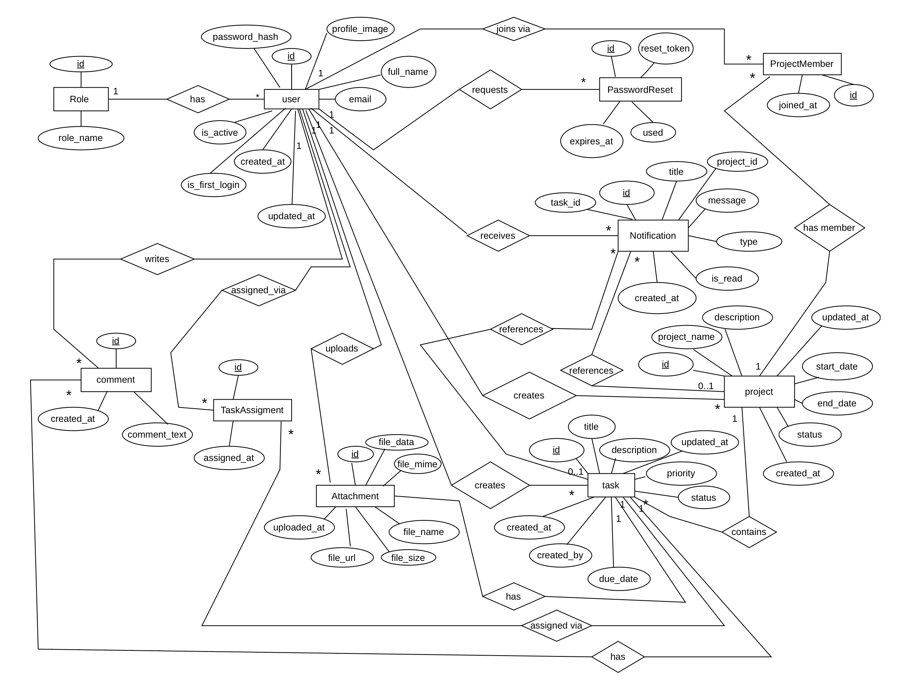
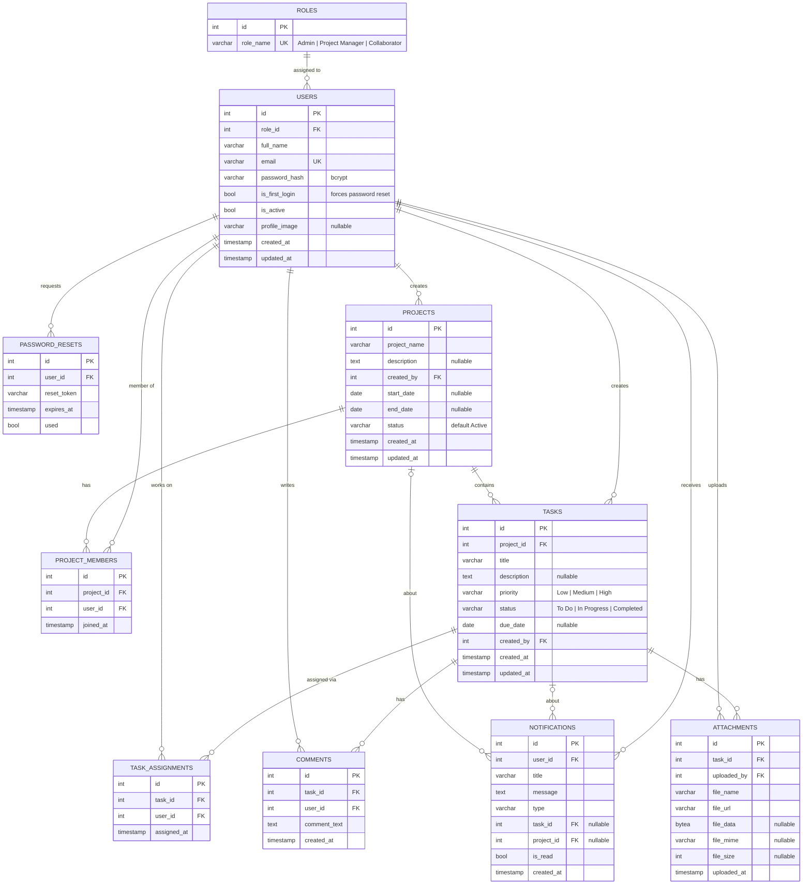
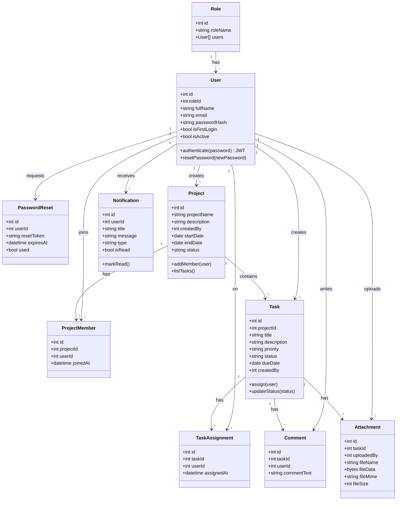
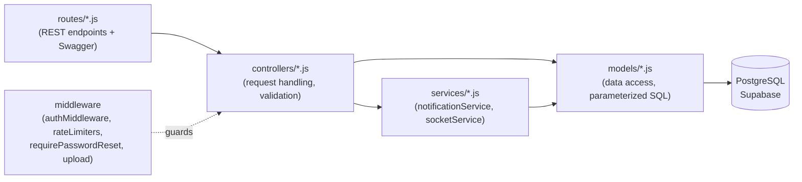
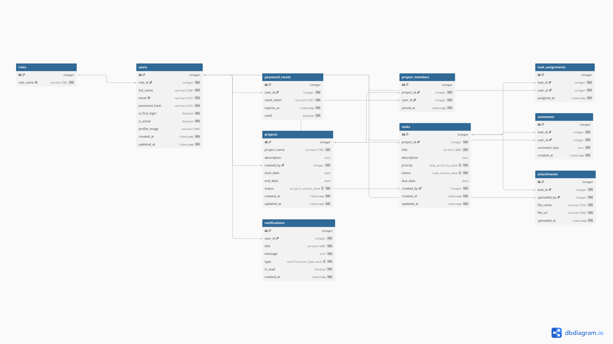
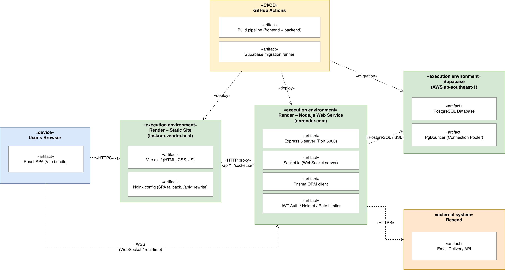
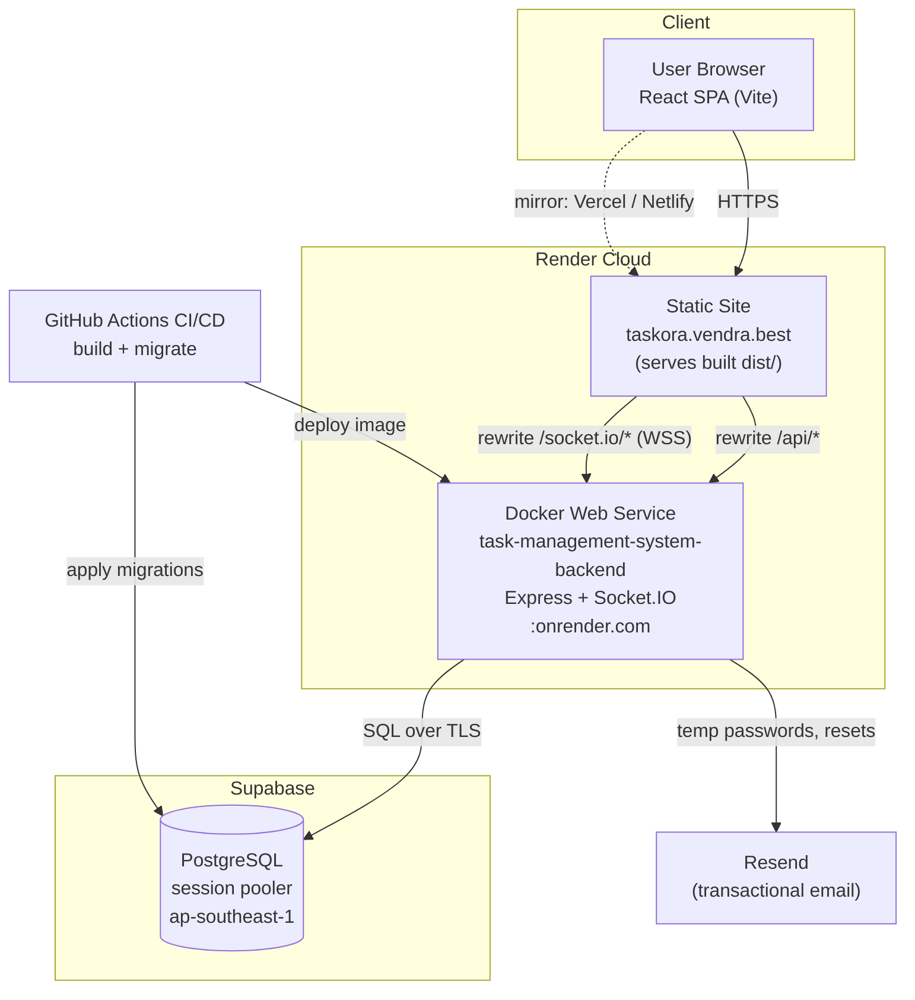

# Taskora — System Diagrams

Design diagrams for the Task Management System (INTE 21323), covering the SRS
*Deliverables* requirement: **ER diagram, Class diagram, DB design, and Deployment
diagram**. Each section shows the **authored diagram** (image, with a high-resolution
PDF where available) alongside a **text-based [Mermaid](https://mermaid.js.org/)
version** that renders natively on GitHub. Sources of truth:
[`backend/prisma/schema.prisma`](../backend/prisma/schema.prisma),
[`supabase/migrations/`](../supabase/migrations), and [`render.yaml`](../render.yaml).

---

## 1. Entity–Relationship (ER) Diagram

Ten entities. `roles → users` is one-to-many; `project_members` and
`task_assignments` are many-to-many join tables; `notifications` link optionally to
a task and/or project.

**Authored ER diagram** — high-resolution source: [er-diagram.pdf](diagrams/er-diagram.pdf)

A text-based (Mermaid) version of the same model, for quick reference on GitHub:

**Cardinality notes**

- `project_members` enforces `UNIQUE(project_id, user_id)` — a user joins a project once.
- `task_assignments` enforces `UNIQUE(task_id, user_id)` — a task is assigned to a user once (supports multi-assignee).
- `notifications.task_id` / `notifications.project_id` are nullable FKs with `ON DELETE SET NULL`, so deleting a task/project preserves the notification history.

---

## 2. Class Diagram

Domain model as classes (mirrors the Prisma models) with the key persistence
operations each is exercised through. The backend follows an **MVC + service**
layering: `routes → controllers → services/models → database`.

**Backend layering (MVC + service)**

---

## 3. Database Design

PostgreSQL (Supabase). Engine-level integrity is enforced with primary keys,
foreign keys, unique constraints, `CHECK` constraints, and indexes. The application
layer never concatenates SQL — all access is via parameterized queries / the Prisma
schema (defense in depth).

**Authored schema diagram** — high-resolution source: [database-design.pdf](diagrams/database-design.pdf)

### Tables

| Table | Primary Key | Foreign Keys (on delete) | Unique | Notable columns / constraints |
|---|---|---|---|---|
| `roles` | `id` | — | `role_name` | Seeded: Admin, Project Manager, Collaborator |
| `users` | `id` | `role_id → roles.id` | `email` | `password_hash` (bcrypt), `is_first_login`, `is_active` |
| `password_resets` | `id` | `user_id → users.id` (CASCADE) | — | `reset_token`, `expires_at`, `used` |
| `projects` | `id` | `created_by → users.id` | — | `status` default `Active` |
| `project_members` | `id` | `project_id` (CASCADE), `user_id` (CASCADE) | `(project_id, user_id)` | join table |
| `tasks` | `id` | `project_id` (CASCADE), `created_by → users.id` | — | **CHECK** `priority ∈ {Low,Medium,High}`, **CHECK** `status ∈ {To Do,In Progress,Completed}` |
| `task_assignments` | `id` | `task_id` (CASCADE), `user_id` (CASCADE) | `(task_id, user_id)` | join table (multi-assignee) |
| `comments` | `id` | `task_id` (CASCADE), `user_id → users.id` | — | `comment_text` |
| `attachments` | `id` | `task_id` (CASCADE), `uploaded_by → users.id` | — | `file_data` (bytea), `file_mime`, `file_size` |
| `notifications` | `id` | `user_id` (CASCADE), `task_id` (SET NULL), `project_id` (SET NULL) | — | `type`, `is_read` |

### Integrity & performance

- **CHECK constraints** — `tasks.priority` and `tasks.status` are validated at the DB level (`20260626120000_task_enum_checks.sql`), rejecting bad values even on a direct write.
- **Cascade deletes** — removing a task/project cleans up its assignments, comments, and attachments; notifications keep their history via `SET NULL`.
- **Indexes** — every FK is indexed, plus composite indexes for hot paths: `idx_tasks_project_status`, `idx_notif_user_unread`, `idx_projects_dates`.
- **Migrations** — versioned under [`supabase/migrations/`](../supabase/migrations) and applied in CI ([`.github/workflows/supabase-deploy.yml`](../.github/workflows/supabase-deploy.yml)).

---

## 4. Deployment Diagram

Cloud topology. The frontend is a static Render site that **rewrites** `/api/*` and
`/socket.io/*` to the Render backend container, so the browser talks to a single
origin (clean CORS, real-time over WSS). Backend runs as a Docker container; data
lives in Supabase Postgres; transactional email goes through Resend.

**Authored deployment diagram** (UML deployment view):

A text-based (Mermaid) version:

**Production configuration**

- **HTTPS/WSS everywhere** — TLS terminated at Render; Socket.IO upgrades to secure WebSocket.
- **CORS** — backend `CLIENT_ORIGIN` allow-lists the production domains (`render.yaml`).
- **Secrets via env** — `DATABASE_URL`, `RESEND_API_KEY`, JWT secret set in the Render dashboard, never committed.
- **Cold start** — Render free tier idles; the first request after inactivity takes ~30–60 s (warm the URL before demoing).
- **Mirrors** — `frontend/vercel.json` and `netlify.toml` provide equivalent rewrites for the Vercel/Netlify deployments.
